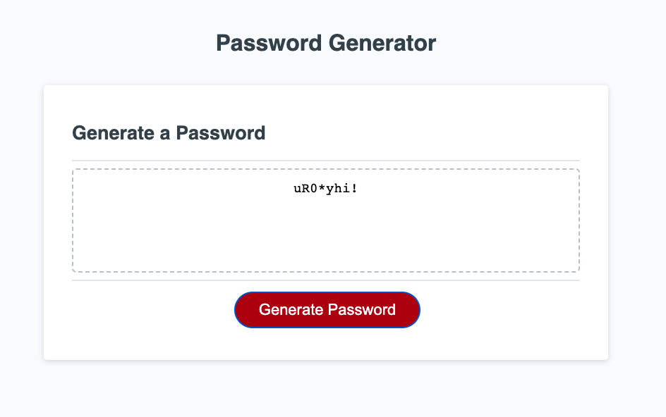

# Password Generator

## Description

The Password Generator is an application that enables employees to generate secure passwords based on their selected criteria. Given these specifications, a randomized list of alpha-numeric and special characters are used to customize a password. This application will run in the browser, featuring HTML and CSS powered by Javascript.

- The motivation for this project is to make secure password generation quick and easy for end users.
- Passwords are required for nearly every user-interface nowadays.
- Encryption reduces inherent security threats and vulnerabilities.
- Lesson: Code solves problems and adds technological value at the root level.

## Table of Contents (Optional)

- [Usage](#usage)
- [Credits](#credits)
- [License](#license)

## Usage

1. Go to your browser.
2. Visit the address listed below.
3. Click the button labeled Generate Password.
4. Enter information as prompted.
5. View your secure password.

Site: https://g6-2flyy.github.io/empl-password-generator/
  
  
 

## Credits

https://www.markdownguide.org/cheat-sheet/

https://gist.github.com/lukas-h/2a5d00690736b4c3a7ba

https://coding-boot-camp.github.io/full-stack/github/professional-readme-guide

## MIT License

Copyright (c) 2023 G6-2Flyy

Permission is hereby granted, free of charge, to any person obtaining a copy of this software and associated documentation files (the "Software"), to deal in the Software without restriction, including without limitation the rights to use, copy, modify, merge, publish, distribute, sublicense, and/or sell copies of the Software, and to permit persons to whom the Software is furnished to do so, subject to the following conditions:

The above copyright notice and this permission notice shall be included in all copies or substantial portions of the Software.

THE SOFTWARE IS PROVIDED "AS IS", WITHOUT WARRANTY OF ANY KIND, EXPRESS OR IMPLIED, INCLUDING BUT NOT LIMITED TO THE WARRANTIES OF MERCHANTABILITY, FITNESS FOR A PARTICULAR PURPOSE AND NONINFRINGEMENT. IN NO EVENT SHALL THE AUTHORS OR COPYRIGHT HOLDERS BE LIABLE FOR ANY CLAIM, DAMAGES OR OTHER LIABILITY, WHETHER IN AN ACTION OF CONTRACT, TORT OR OTHERWISE, ARISING FROM, OUT OF OR IN CONNECTION WITH THE SOFTWARE OR THE USE OR OTHER DEALINGS IN THE SOFTWARE.

---

## Features

- HTML/CSS/Javascript
- URL/Web address
- Mobile responsiveness
- Pseudo-encryption
